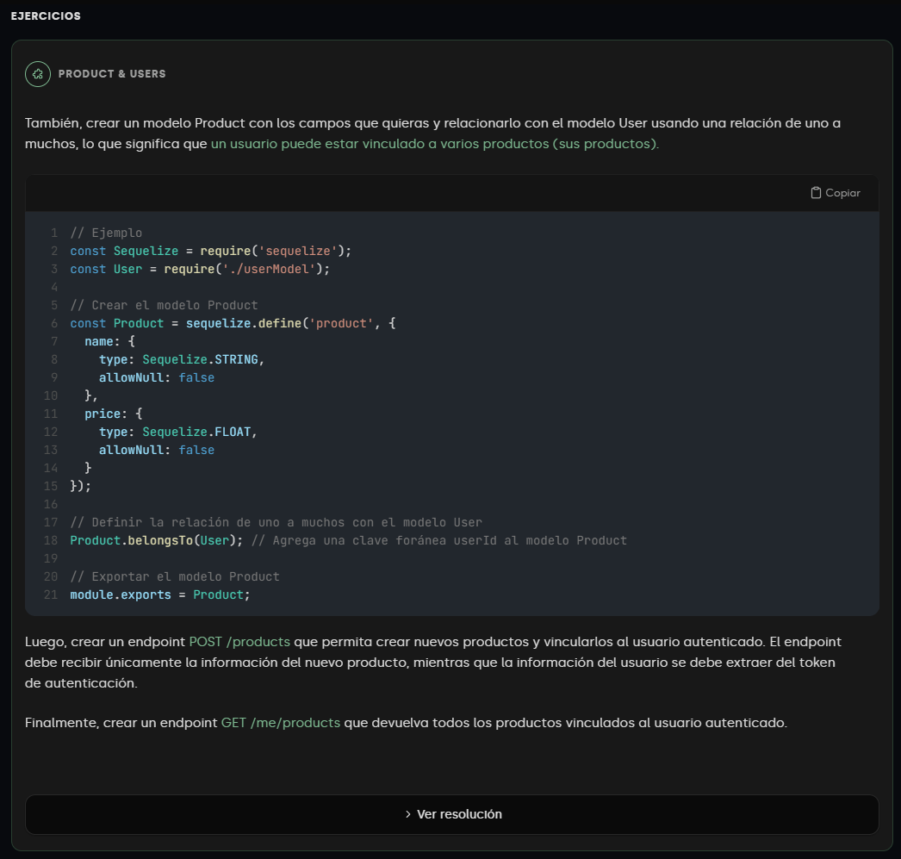

# Simple CRUD API using Auth methods

This project is a simple CRUD API for a simple authentication system. It uses Vite, Typescript, Express, Sequelize and JWT to build a REST API for a simple authentication system.
Practice relations in Sequelize - One to One, One to Many

## Installation

```bash
npm install
```

## Usage

```bash
npm run dev # Run the server in development mode
npm run start # Run the server in production mode
```

## Pic exercise


